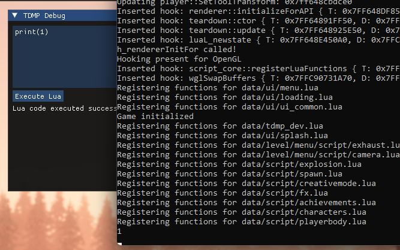

# Teardown Console
Allows you to execute Lua commands from a console by pressing F8.  
Currently working on experimental 1.6.0, should also work on 1.5.4 and possibly previous versions. You might need to run the dumper though, just launch the launcher with `-generate-structs -dump`. Before pressing OK to continue, paste the contents into the respective files.  

DX12 and OpenGL are both supported as well :)



# For Developers

## Requirements
- [Premake](https://premake.github.io/)
- [VCPKG](https://vcpkg.io/en/)
  - Once installed, set an environment variable called `VCPKG_ROOT` and set it to the root directory of vcpkg
  -----------------------------------------------------------------
  - vcpkg install argparse:x64-windows-static
  - vcpkg install minhook:x64-windows-static

- [Child Process Debugging Power Tool](https://marketplace.visualstudio.com/items?itemName=vsdbgplat.MicrosoftChildProcessDebuggingPowerTool)
  - This makes it so if you debug the launcher, it will then debug Teardown after CreateProcess is called, extremely helpful for debugging

- [Steamless](https://github.com/atom0s/Steamless/releases) (Required for running debug builds, it allows Teardown to be debugged)
  - This will create a `teardown.exe.unpacked.exe` and the launcher will use this instead of the original

## Dependencies
- [ImGui Docking](https://github.com/ocornut/imgui/tree/docking)

## How to build
```
1. Run `premake5 vs2022` in your command line
2. Open the generated solution file in Visual Studio
3. Build the solution
```